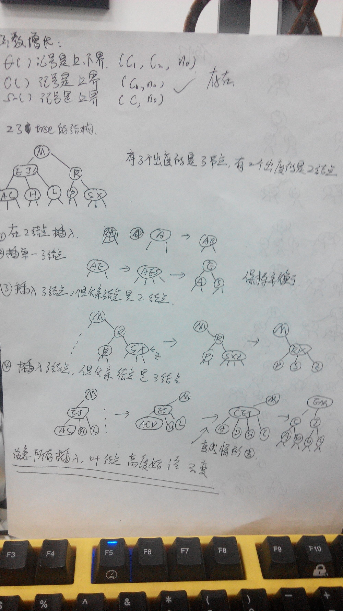
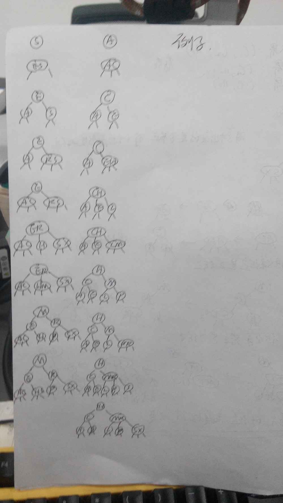
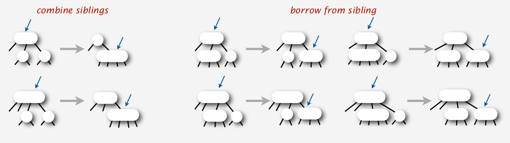
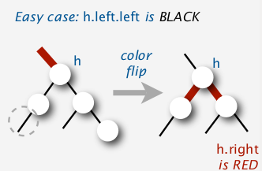
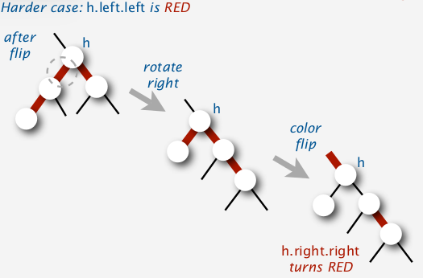
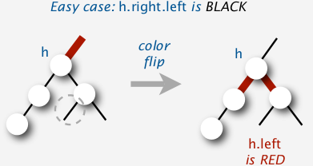
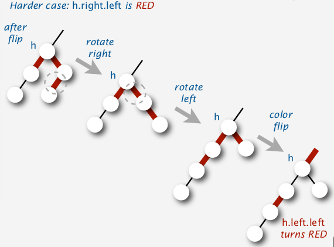

#前言
原来讲清楚一个东西比写清楚一个东西难得多

#二叉树之红黑树

本次主要谈讨论二叉树中的红黑树.

##算法的函数增长率

算法主要考虑时间和空间.

这里我们讨论如何估算时间和空间复杂度.

有很多种函数定义:这里主要讲大O(还有几个概括一下,记在纸上)

对于任意两个函数来说,不能总是确定大小的,会存在有某个点大小关系发生转换,所以我们并不直接
比较两个函数,而比较两个函数的增长率.
[这个](http://bigocheatsheet.com)网站可以查看对应的时间复杂度和空间复杂度,

比如说1000n比n方大,在早期的时候.但是还是会存在交点,大小关系变化(当n=1000的时候).

所以第一个定义就意味着:c\*f(n),当n0的时候始终比T(n)大.
c\*f(n)为一个算法在n足够大的时候提供一个上界.
比如T(n)=1000n,f(n)=n^2,n0=1000,c=1,也可以用n0=10,c=100.
如果存在这样一个函数的话,那么就可以称为T(n)是O(f(n))的.

这里再提一下NP问题.

有时候可能碰到一个NP问题,目前这种问题的解是否存在是未知的,如果你碰到了,却不知道是否是NP问题,
会浪费大量的时间.
比如旅行商就是NP问题.

P问题描述的是一个算法能否能够在多项式的时间内解决,而NP问题则描述的是能否在多项式的时间内验证问题的答案.
P肯定是NP问题,因为都在多项式内解出来了,验证都不用了.

而NPC问题则是说,NP问题都可以规约到NPC问题上,如果给出了NPC的一种解法,就能证明P=NP.至今没有找到,所以大家对
P=NP的信心大打折扣.

关于NP,恕我愚昧不能完全解释清楚,科普性得理解可以参看这篇[博客](http://www.guokr.com/article/437662/).
还有这篇[博客](http://blog.sciencenet.cn/blog-327757-667308.html).

##题外话
算法的正确性,如果你去使用它,要么它的证明说服了你,要么它从直觉上讲解释得通.

#二叉树

####什么是二叉树?

符合二叉的树形结构,一个父亲结点有两个子节点.

####什么是二叉搜索树?

左结点小于父亲结点,右结点大于父亲结点.

####为什么要有二叉搜索树,二叉搜索树相对于链表,散列表的效率如何?

二叉搜索树的搜索效率=O(h).(h是这颗树的高度)
因为自顶向下直到找到对应结点都是一条简单路径,树的高度是一个上限.
这里不重点讨论二叉搜索树,只简要提及一些性质,有兴趣可以自己完成一个二叉搜索树的插入删除和搜索.

链表的搜索是线性的,但是插入删除都是常数(不包括查找某个结点需要的搜索时间).
而二叉树的删除和插入除了搜索本身之外还有调整平衡,不能达到常数级别.

另外再讨论一下散列表,这也是面试的时候经常问的一个问题,散列表在效果哈希函数效果比较好的时候搜索是常数的.
但是并不能有序,而二叉搜索树是可以有序的,比如寻找0到5000之间的结点,二叉树只要找一头一尾,之间的中序遍历,
而散列表则要访问5000次,所以不能够体现其优点,另外在开销上,散列表的空间开销更大.

####为什么希望二叉搜索树平衡?

因为如果二叉搜索树不平衡的话,很容易影响查找效率,特殊情况直接退化成链表.

#红黑树

红黑树的性质:
性质1:节点是红色或黑色.
性质2:根是黑色.
性质3:所有叶子都是黑色（叶子是NIL节点）.
性质4:每个红色节点必须有两个黑色的子节点.(从每个叶子到根的所有路径上不能有两个连续的红色节点)
性质5:从任一节点到其每个叶子的所有简单路径都包含相同数目的黑色节点.

这次讨论的是一个相对来说比较特殊的一种数据结构红黑树.
红黑树是平衡树的一种,因为二叉搜索树没有一个稳定的搜索效率,所以需要一个每个叶子结点高度能够相近的一种数据结构,
而这里提到的红黑树能够做到非常好的平衡,下面要提到的红黑树是2008年的一篇论文[1]对红黑树的改进.

###引入23树

23树可以完美平衡的树结构.
2-node,3-node,4-node.
板书演示,23树的平衡,内容参考纸质板书.

###由23树转化为红黑树

把3-node变成一个横着的两个2-node,就能够转化为红黑树.
用入度的颜色表示点的颜色,3-node的连线用红色表示.

这种红黑树的理解方式要充分理解2-3树才可以.

###左倾红黑树的插入

现在讨论一下红黑树的插入.
演示左旋,右旋和变色.
说明左旋和右旋不会影响平衡,变色可能向上引入红色结点.

根据板书讨论四种情况.

###左倾红黑树的删除

从2-3树来看,从叶子处删除一个3-node不会影响平衡,所以我们要让一个红色的link一直向下移动并且保持平衡.
在向下搜索的时候,使用变色和旋转,来保证搜索到的结点不是一个2-node,再自底向上调整.

####热身,删除最大结点

2-3树是如何删除的?

从图上可以直观地看出,就是把单节点填充,一直向右移动.

对于combine siblings 只要对当前结点变色就可以.

对于borrow siblings 需要做一次变色,做一次右旋,再做一次变色.
也就是如图所示,变色之后,形成了一个5-node,一次右旋可以把父结点的右指针向左移动一个,
这样就向右边留出了两个结点,最后一步变色回去,也就是把h结点挤回父亲结点当中去.

反应在左倾红黑树上呢?
因为要删除最大结点,这个结点在右边,所以需要通过右旋来实现.
右旋还是一个3-node,不会影响其它结构,如果右子结点是一个单节点就需要通过
借结点来填满,类似于2-3树的移动方式.

总得来说moveRedRight把经过的结点调整成右倾,然后自底向上调整回去.

Q&A

1.  如果连续引入两个4-node,调整能调整回去么?
    注意2-3树的向右移动,不会出现两个连续的4-node.
    要凭空产生一个4-node只有一种情况,这种情况4-node的父结点是单节点,
    不需要向上追溯.

####热身,删除最小结点

和删除最大结点类似,但是因为是左倾的所以有点不同.
如果左结点是单独结点,需要补一个结点.
与之前类似的如果有单节点,就把上面的结点挤下来.

如果右结点的左结点是红色,冲突了,形成了一个5-node,跟之前提到的方法类似,
先是通过右旋加左旋,把指针向后挪移个,腾出两个结点在左边.
最后再变色,把结点挤回到父结点.

####删除任意结点

如果找到该结点,就用右子树的最小值给这个结点赋值,然后删除右子树的最小结点即可.
之前就是不断地把一个红色结点通过左倾或者右倾传递过来.

体现在2-3树上就是不断地给对应方向的单节点借结点,来保证到最后删除该结点时不是单结点.

####总结

这两个函数形象上的功能就是把一个红色连接向右或者向左传递.

####红黑树搜索时间复杂度的证明
TODO
可以参考维基百科证明

#相关资料

1. [左倾红黑树讲义PDF](http://222.26.160.148/videoplayer/RedBlack.pdf?ich_u_r_i=5ff7abc3e9e5edde285689bc8dcac1eb&ich_s_t_a_r_t=0&ich_e_n_d=0&ich_k_e_y=1545038911750263252407&ich_t_y_p_e=1&ich_d_i_s_k_i_d=1&ich_u_n_i_t=1)
2. [传统红黑树及复杂度证明](http://zh.wikipedia.org/wiki/%E7%BA%A2%E9%BB%91%E6%A0%91)
3. [算法第四版Java](http://algs4.cs.princeton.edu/home/)

